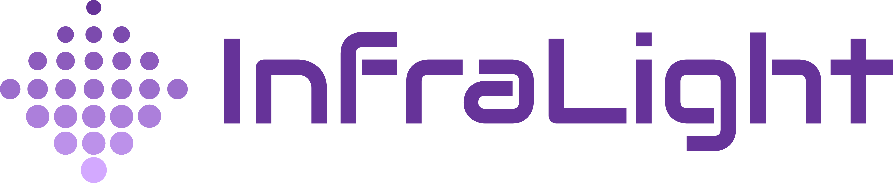

# 

**Infralight Kubernetes Collector**

<!-- vim-markdown-toc GFM -->

* [Overview](#overview)
* [Configuration](#configuration)
* [OCI Image](#oci-image)
* [Server-Side Notes](#server-side-notes)
* [Production Set-Up](#production-set-up)
    * [Requirements](#requirements)
    * [Quick Start](#quick-start)
* [Local Development](#local-development)
    * [Requirements](#requirements-1)
    * [Unit Tests and Static Code Analysis](#unit-tests-and-static-code-analysis)
    * [Quick Start](#quick-start-1)

<!-- vim-markdown-toc -->

## Overview

This repository contains Infralight's Kubernetes Collector, which collects
information from a customer's Kubernetes cluster and sends it to the Infralight
SaaS. This means it is an on-premises component.

The collector is implemented in the [Go programming language](https://golang.org/) and packaged as an
[OCI image](https://github.com/opencontainers/image-spec). It uses the official [Go client](https://github.com/kubernetes/client-go) provided by the
Kubernetes project for the benefits it provides over manually accessing the
Kubernetes API.

The collector is currently implemented as a job meant to be run as a Kubernetes
[CronJob](https://kubernetes.io/docs/tasks/job/automated-tasks-with-cron-jobs/). While this means the job's execution interval is at the discretion
of the customer, this provides the ability to trigger the job manually at any
given time without having to restart or add triggering capabilities to a
Kubernetes [Deployment](https://kubernetes.io/docs/concepts/workloads/controllers/deployment/).

The collector collects various objects from the Kubernetes cluster and sends them
as-is to Infralight. Currently, the set of object types collected is hard-coded,
but logic may be added to the collector to receive instructions from Infralight
to fetch more objects, or to use the Go client's [discovery](https://pkg.go.dev/k8s.io/client-go@v1.5.2/1.5/discovery) library
to fetch objects of other types.

## Configuration

Since Kubernetes does not provide a way to access a unique name or ID for a
cluster, a cluster identifier must be provided to the collector. It can either
be provided via a command line argument, or via the `CLUSTER_ID` environment
variable. The command line argument has precedence over the env var. The cluster
ID must only contain lowercase alphanumeric characters, dashes and underscore
(spaces are not allowed).

The collector must also be configured with an Infralight-provided access and secret
keys in order to be able to send data to Infralight. These keys musy be provided
as environment variables called `INFRALIGHT_ACCESS_KEY` and `INFRALIGHT_SECRET_KEY`,
respectively. It is recommended that these keys are stored as a Kubernetes
[Secret](https://kubernetes.io/docs/concepts/configuration/secret/) and automatically injected into the collector's pod.
A [sample secret template](data/secret.sample.yaml) is included in the repository.

The collector's behavior may also be configured and modified via an optional
Kubernetes [ConfigMap](https://kubernetes.io/docs/concepts/configuration/configmap/). This allows changing the HTTP endpoint to which data
is sent, enable/disable the collection of object types, and more. Currently,
this ConfigMap must be named "infralight-k8s-collector-config" to be accepted by
the collector. A [sample ConfigMap template](data/configmap.sample.yaml) is
included in the repository.

If a ConfigMap does not exist, default configuration options will be used. By
default, secrets will _not_ be collected, but all other supported object types
will. See [here](https://github.com/infralight/k8s-collector/blob/main/collector/config.go#L81) for a list of supported configuration options and their
default values.

## OCI Image

A standard [Dockerfile](Dockerfile) is included to package the collector as an OCI image.
This Dockerfile uses the official [Alpine-based Go image](https://hub.docker.com/_/golang) from Docker Hub
with a [multi-stage build](https://docs.docker.com/develop/develop-images/multistage-build/) process to compile the collector into a
[statically-linked binary](https://en.wikipedia.org/wiki/Static_library). The resulting image does not use any base layer,
thus keeping its size as small as possible.

The image is named `infralight/k8s-collector`.

## Server-Side Notes

The collector sends the collected objects to the Infralight endpoint serialized
via JSON. Requests will be compressed using the gzip algorithm, unless
compression fails, in which case no compression will be used. The server MUST
inspect the contents of the `Content-Encoding` request header to check whether
the request body is compressed or not, and only attempt to decompress using
`gzip` if the header's value is `"gzip"`.

The JSON format of each request is as follows:

```json
{
    "objects": [
        { "kind": "Pod", "metadata": { "name": "bla", "namespace": "default" } },
        { "kind": "CronJob", "metadata": { "name": "bla", "namespace": "default" } }
    ]
}
```

The format of object types themselves is generally consistent, and is
documented [here](https://github.com/kubernetes/community/blob/master/contributors/devel/sig-architecture/api-conventions.md#types-kinds).
See [this](https://pkg.go.dev/k8s.io/api/core/v1#Pod) for an example of the structure of an object of type Pod.

When a request is handled by the Infralight endpoint, it is expected to return
a [204 No Content](https://developer.mozilla.org/en-US/docs/Web/HTTP/Status/204) response with no body, unless an error has occurred.

## Production Set-Up

In production, the collector should be configured as a Kubernetes [CronJob](https://kubernetes.io/docs/concepts/workloads/controllers/cron-jobs/),
and provided access to collect information from the cluster via a
[service account](https://kubernetes.io/docs/tasks/configure-pod-container/configure-service-account/).

A [sample CronJob template](data/cronjob.sample.yaml) is included in the repository.
Permissions must be provided to the service account via a Cluster Role and a
Cluster Role Binding. Sample files for both ([Cluster Role](data/clusterrole.sample.yaml),
[Cluster Role Binding](data/clusterrolebinding.sample.yaml)) are included in the repository.
These can be provided as-is to customers, but they may wish to modify them,
depending on the configuration and the type of Kubernetes resources they wish
to provide Infralight access to. For example, permission to view secrets is
disabled by default and thus is commented out in the sample file.

### Requirements

* [Kubernetes](https://kubernetes.io/) v1.15+
* [kubectl](https://kubernetes.io/docs/tasks/tools/#kubectl) v1.18+

### Quick Start

1. Create the Cluster Role.
    ```sh
    kubectl create -f data/clusterrole.sample.yaml
    ```
2. Bind the default service account to the Cluster Role:
    ```sh
    kubectl create -f data/clusterrolebinding.sample.yaml
    ```
3. Grant the default service account access to the role binding:
    ```sh
    kubectl create clusterrolebinding default-view --clusterrole=infralight-view --serviceaccount=default:default
    ```
4. Create the K8s CronJob for the collector:
    ```sh
    kubectl create -f cronjob.sample.yaml
    ```
5. Inspect the job using the command line:
    ```sh
    kubectl get jobs --watch
    ```

The sample file triggers the job at 15 minute intervals.

## Local Development

During development, the collector may be run outside of the cluster without
having to package it in an image, or inside the cluster. It is recommended to
use `minikube` for local development.

### Requirements

* [Go](https://golang.org/) v1.16+
* [Docker](https://www.docker.com/) v20.10+
* [minikube](https://minikube.sigs.k8s.io/docs/) v1.18+
* [kubectl](https://kubernetes.io/docs/tasks/tools/#kubectl) v1.18+
* [golangci-lint](https://golangci-lint.run/) v1.35+

### Unit Tests and Static Code Analysis

The collector includes standard Go unit tests, and uses [golangci-lint](https://golangci-lint.run/) to run a
comprehensive suite of static code analysis tools. The GitHub repository is set-up
to compile the collector, run the unit tests and execute the static code analysis
tools on every commit. The Dockerfile is also set-up to do the same thing when
building the image.

Locally, these steps can be executed like so:

```sh
$ go build
$ go test ./...
$ golangci-lint run ./...
```

### Quick Start

1. Make sure the Docker daemon is running.
2. Start minikube on top of Docker:
    ```sh
    minikube start --driver=docker
    ```
3. Create the Cluster Role.
    ```sh
    kubectl create -f data/clusterrole.sample.yaml
    ```
4. Bind the default service account to the Cluster Role:
    ```sh
    kubectl create -f data/clusterrolebinding.sample.yaml
    ```
5. Grant the default service account access to the role binding:
    ```sh
    kubectl create clusterrolebinding default-view --clusterrole=infralight-view --serviceaccount=default:default
    ```
6. Create the ConfigMap for the collector, if needed:
    ```sh
    kubectl create -f data/configmap.sample.yaml
    ```
7. To run the collector out-of-cluster, execute:
    ```sh
    INFRALIGHT_ACCESS_KEY=<accessKey> INFRALIGHT_SECRET_KEY=<secretKey> \
        go run main.go -external ~/.kube/config -debug <clusterId>
    ```
8. To run the collector in-cluster, more steps are required:
    1. Load environment variables so the Docker client works against the local `minikube` Docker daemon:
        ```sh
        eval $(minikube docker-env)
        ```
    2. Build the collector's Docker image:
        ```sh
        docker build -t infralight/k8s-collector:1.0.0 .
        ```
    3. Create the secret containing the API key:
        ```sh
        kubectl create -f data/secret.sample.yaml
        ```
    4. Create the K8s CronJob for the collector:
        ```sh
        kubectl create -f data/cronjob.sample.yaml
        ```
    5. Inspect the job using the command line or the minikube Dashboard:
        ```sh
        minikube dashboard
        ```
    6. Cleanup:
        ```sh
        kubectl delete cronjob infralight-k8s-collector
        eval $(minikube docker-env -u)
        ```
